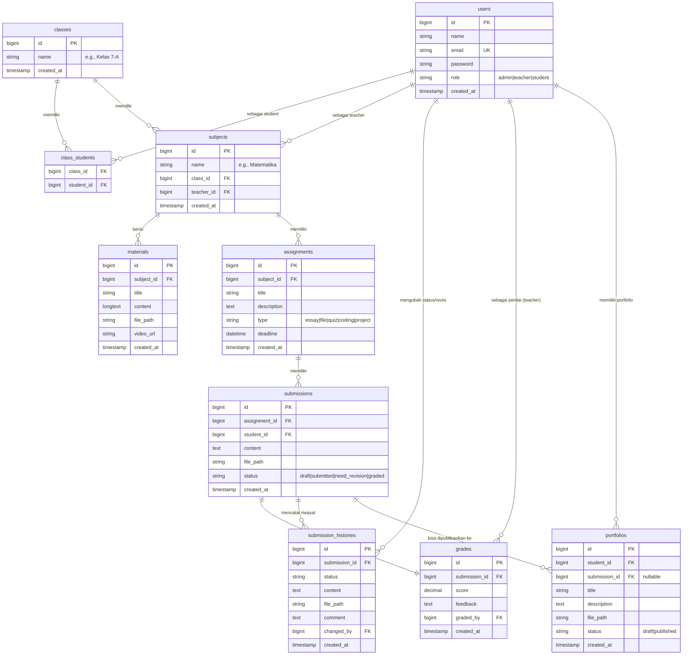

# ENTITY RELATIONSHIP DIAGRAM (ERD) - EDUSPHERE LMS

Dokumen ini memetakan seluruh entitas data dan hubungan relasional dalam database LMS Edusphere.

---

## 1. Diagram ERD (Mermaid)

---

## 2. Penjelasan Relasi
1. **Relasi Kelas & Siswa (`class_students`)**:
   - Menghubungkan banyak siswa ke suatu kelas tertentu (banyak ke banyak / *many-to-many*).
2. **Relasi Mata Pelajaran (`subjects`)**:
   - Setiap subjek (mata pelajaran spesifik untuk kelas tertentu) terikat ke **satu Kelas** (`class_id`) dan **satu Guru** (`teacher_id`).
3. **Relasi Materi & Tugas (`materials` & `assignments`)**:
   - Terikat langsung ke mata pelajaran spesifik (`subject_id`).
4. **Relasi Pengumpulan Tugas (`submissions`)**:
   - Menghubungkan tugas (`assignment_id`) dengan siswa yang mengerjakan (`student_id`).
5. **Relasi Riwayat Pengumpulan (`submission_histories`)**:
   - Menyimpan jejak audit (*audit trail*) setiap kali ada perubahan status tugas atau pengiriman revisi baru.
6. **Relasi Nilai (`grades`)**:
   - Berelasi satu-ke-satu (*one-to-one*) dengan `submissions`. Setiap pengumpulan tugas hanya dapat memiliki satu entri nilai final.
7. **Relasi Portofolio (`portfolios`)**:
   - Menghubungkan karya siswa dengan akun siswa (`student_id`). Siswa dapat melampirkan tugas yang telah dinilai (`submission_id`) sebagai item portofolionya.

